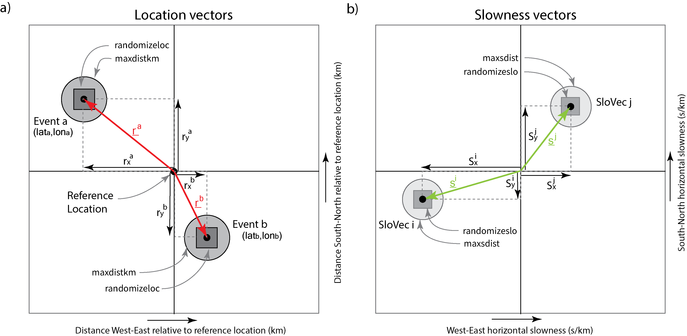

# VIScERaL
**VIScERaL**: **V**ectorized **I**terative **S**eismi**c** **E**vent **R**el**a**tive **L**ocation  

Release v1.0.1 is permanently stored on Zenodo with DOI 10.5281/zenodo.8205776  
[](https://zenodo.org/badge/latestdoi/654975532)  

https://doi.org/10.5281/zenodo.8205776  

[](https://api.eu.badgr.io/public/assertions/w6gj49upSFK_mYONZZHODA "SQAaaS bronze badge achieved")  

[](https://api.eu.badgr.io/public/assertions/w6gj49upSFK_mYONZZHODA "SQAaaS bronze badge achieved")  

The main code in this repository is a stand-alone python code called **VIScERaL_GD.py** (where the GD stands for Gradient Descent).

There is a second python code **statphase2slowvec.py** which is taken from https://github.com/stevenjgibbons/statphase2slowvec and which is needed to calculate the theoretical slowness vector files. It is included also here for the sake of convenience.

The purpose of the program is to solve for the relative locations of seismic events and/or the slowness vectors which describe the speed and direction with which the seismic waves leave the source area. The user only ever needs relate to the geographical coordinates of the seismic events even though it is the Cartesian position vectors that are used in the solution.

Each run of VIScERaL_GD.py requires three files, specified as follows:

**--abslocflagsfile** (file containing the absolute locations of events)  
**--slovecsflagsfile** (file containing the slowness vectors)  
**--dtfile** (file containing the differential times)  

We take a starting set of locations and slowness vectors (possibly with some random perturbations from the starting values) and we repeatedly evaluate a cost-function and its gradients moving the events and/or slowness vectors until a certain number of iterations is reached for which the cost-function does not decrease.  

If all the slowness vectors are fixed, the seismic events will tend to converge to the same locations on each run.  

If all the seismic events are fixed, the slowness vectors will tend to converge to the same states on each run.  

If both seismic events and slowness vectors are allowed to move then there is a fundamental non-uniqueness in the solutions. (If the velocities are faster then the events move further apart. If the velocities are slow then the events will move closer together.) However, repeat calculations with perturbed starting conditions will likely demonstrate significant relations between different events and different slowness vectors that become apparent in a statistic sense. If you are running a calculation with both variable events and slowness vectors it is recommended a three stage process:  

**(1)** First solve event locations for the most realistic set of slowness vectors at your disposal. The program **statphase2slowvec** (https://github.com/stevenjgibbons/statphase2slowvec) will generate an appropriate file based upon the ak135 model. Each line from this file needs to have a letter "F" (fixed) or "S" (solve) appended.  

**(2)** Fix the event locations according to the output obtained in step 1 and then solve for the slowness vectors which best fit these event locations.  

**(3)** Solve for both event locations and slowness vectors using starting conditions obtained from step (2).  

# Mandatory arguments to VIScERaL_GD.py

```
**--abslocflagsfile** (file containing the absolute locations of events)  
**--slovecsflagsfile** (file containing the slowness vectors)  
**--dtfile** (file containing the differential times)  
**--reflat**  (a reference latitude within the source area)  
**--reflon**  (a reference longitude within the source area)
```

# Additional arguments to VIScERaL_GD.py

    **delkm**   (step length = learning rate for distance, def 0.1 km)  
    **delslow** (step length = learning rate for slowness, def 0.1 s/km)  
 
    **delkmmax** (the largest distance in km an event can be moved
                 in a single iteration, def 0.005 km)  
    **maxdistkm** (the largest distance in km an event can be moved
                  from its original location in the whole run, def 999.9 km)  
    **randomizeloc** (dist within which location can be moved randomly
                     at start, def = 0.0 km. Note that this distance applies
                     independently in the x and y directions so the initial
                     event location is placed randomly within a square centered
                     on the specified location.)  
 
    **delslomax** (distance in s/km a slowness can be moved in a single
                  iteration, def 0.0005 s/km )  
    **maxsdist** (the largest distance in s/km a slowness vector can be moved
             from its original specification in the whole run, def 999.9 s/km)  
    **randomizeslo** (dist within which slowness vector can be moved randomly
                     at start, def = 0.0 s/km. Note that this distance in slowness applies
                     independently in the x and y directions so the initial
                     slowness vector is placed randomly within a square centered
                     on the specified slowness vector.)  
 
    **writehistory** (specify to write out the locations of every variable
                     at every iteration. In general you will not want to
                      do this as it generates huge ASCII files which you will
                       not want unless you want to visualize the evolution
                        of the solution. Use sparingly! def = False )  
 
    **allowmissing** (Skip any lines in dtfile containing station/phases
                     or events not found. def = False, but you will often
                      want to set it to True.)  
 
    **FixEvent0** (even if the first line in the list of events ends in "S"
                  we shift the whole set of events such that this event
                    stays in the same location, def = False )  
                     
    **locoutfile** (locations output file, def = "locations.txt")  
    **slooutfile** (slowness output file, def = "slowness_vectors.txt")  
    **nrmoutfile** (norms output file, def = "normValues.txt" )  
 
    **blocksize** (Number of iterations at which we solve either for
                  events or slowness vectors, assuming we are solving for
                   both. def = 0 - i.e. we solve for both at each iteration.
                    I am not convinced there is any point in setting > 0.)  
 
    **numrandom** (At each iteration, for each unknown, we pick a random number
                  of measurements from which we estimate the gradient.
                   def = 20. If there are fewer observations than this for
                    an unknown event or slowness vector it will just keep
                     picking the observations randomly this number of times.)  
 
    **maxiter** (The maximum number of iterations, def = 10000 )  
    **maxpositiveslopes** (The maximum number of times that the median slope
                          of the median residual norm can be >= zero
                            before we end the procedure. def = 100 but you
                              will likely want to increase this to a few
                                hundred. Do not make this value too large
                                  or the solution may just evolve to something
                                    far from the starting value.)  

# Format of the abslocflagsfile  

```Time_in_UTC_format      latitude   longitude   event_code  Fixed/Solve/Ignore```

```
2007-08-15T07:59:59.936 67.93590352 25.83491289 H01  F
2007-08-17T11:00:00.380  67.93590352  25.83491289  H06   S
2007-12-01T00:00:00.000  67.94        25.835       HXX   I
```


# Format of the slovecsflagsfile

```station phase   statlat    statlon   reflat     reflon      Sx            Sy       flag```  

e.g.  
```
  ARE0  P1        69.53490   25.50580  67.93590   25.83491   -0.00888570    0.12337091 F
  ARE0  S1        69.53490   25.50580  67.93590   25.83491   -0.01594664    0.22140645 F
  KEV   P1        69.75530   27.00670  67.93590   25.83491    0.02687697    0.12073203 F
  KEV   S1        69.75530   27.00670  67.93590   25.83491    0.04823417    0.21666916 F
  SGF   P1        67.44211   26.52611  67.93590   25.83491    0.08181667   -0.15176232 F
  SGF   S1        67.44211   26.52611  67.93590   25.83491    0.13714934   -0.25439928 F
  LP34  P1        67.26574   28.12528  67.93590   25.83491    0.13871543   -0.10238026 F
  LP34  S1        67.26574   28.12528  67.93590   25.83491    0.23252879   -0.17162010 F
  LP53  P1        68.08434   27.18877  67.93590   25.83491    0.16493699    0.05021592 F
  LP53  S1        68.08434   27.18877  67.93590   25.83491    0.27648398    0.08417697 F
  LP61  P1        67.91408   23.93216  67.93590   25.83491   -0.17239066   -0.00260066 F
  LP61  S1        67.91408   23.93216  67.93590   25.83491   -0.28897858   -0.00435949 F
```

# Format of the dtfile

```ev1  ev2   starting_time_ev1_template   CC_time_for_ev2    station phase  ignored```  

   e.g.  
```
  H01  H02  2007-08-15T08:00:19.109  2007-08-15T12:00:19.299  LP34   P1  0.850
  H01  H02  2007-08-15T08:00:33.100  2007-08-15T12:00:33.286  LP34   S1  0.798
  H01  H02  2007-08-15T08:00:08.467  2007-08-15T12:00:08.709  LP53   P1  0.926
  H01  H02  2007-08-15T08:00:15.228  2007-08-15T12:00:15.476  LP53   S1  0.813
```

  
